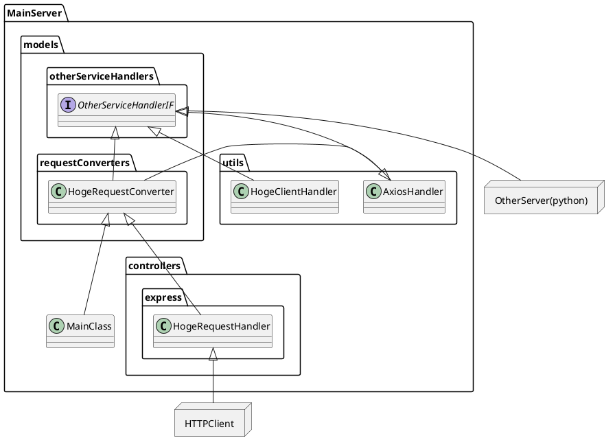

# クラス図

```plantuml
@startuml

node "HTTPClient" as HTTPClient {
}

package "MainServer" as MainServer {
    class MainClass
    package controllers {
        package express {
            class HogeRequestHandler
        }
    }
    package models {
        package requestConverters {
            class HogeRequestConverter
        }
        package otherServiceHandlers {
            interface OtherServiceHandlerIF
        }
    }
    package utils {
        class AxiosHandler
        class HogeClientHandler
    }
}

node "OtherServer(python)" as OtherServer {
}

HogeRequestConverter <|-- MainClass
HogeRequestConverter <|-- HogeRequestHandler
OtherServiceHandlerIF <|-- HogeRequestConverter
AxiosHandler <|-- HogeRequestConverter
OtherServiceHandlerIF <|-- OtherServer
OtherServiceHandlerIF <|-- AxiosHandler
OtherServiceHandlerIF <|-- HogeClientHandler
HogeRequestHandler <|-- HTTPClient

@enduml
```